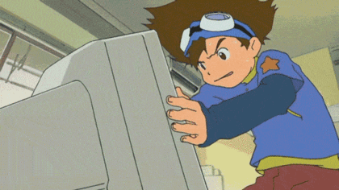

## Hi :smile: I'm Sumin.
I'm a Software Engineer at Techwing, working on semiconductor test handler systems.
   
I graduated from Seoul National University of Science and Technology (SeoulTech) with a major in Mechanical System Design Engineering and a double major in Computer Engineering.

<!--
**1213tnals/1213tnals** is a ✨ _special_ ✨ repository because its `README.md` (this file) appears on your GitHub profile.

Here are some ideas to get you started:
-->

- 🔍 I researched 6-DoF manipulator trajectory planningp for automated robot arm system at [HRRLAB](http://www.hrrlab.com/), which is Humanoid Robot Research Lab. During my time there, I also developed an intergrated mobile manipulator system controlled by a VR controller.
     
- 🌱 I worked on 3D reconstruction algorithms and extended reality (XR) programming using Unity as part of my capstone project. I aimed to build a human-centered interaction system that can recreate captured moments and enable realistic interaction in remote environments.
- My ultimate goal is to develop services that allow people to relive their precious moments, offering them inspiration and empowerment.   
<!--
- 👯 I’m looking to collaborate on ...
- 🤔 I’m looking for help with ...
- 💬 Ask me about ...
- 
- 😄 Pronouns: ...
-->
- ⚡ Fun fact
  * Robotics, XR
  * Telepresence, Teleoperation
  * Experience Reconstruction, Embodied Experience

- 📫 How to reach me: https://www.linkedin.com/in/chosumin/, https://www.youtube.com/@user-suminn   
